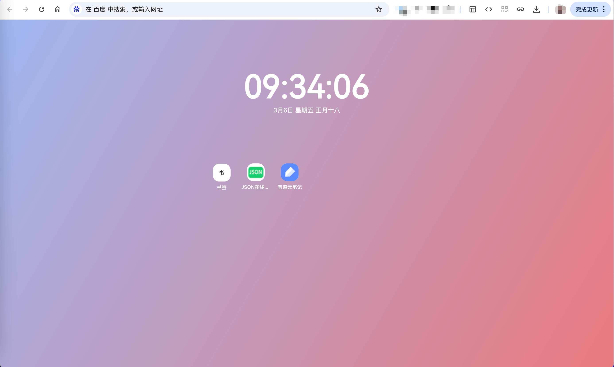

# Chrome 新标签页扩展

[](https://www.apache.org/licenses/LICENSE-2.0.html)

Vite + Vue 3 + TypeScript 构建的 Chrome 新标签页扩展。

## 功能

- 覆盖chrome浏览器新标签页
- 像操作系统桌面一样，添加自定义组件和快捷入口
- 支持自定义背景图片和颜色
-

## 简介




## 开发

```bash
# 安装依赖
npm install

# 构建
npm run build

# 开发模式（监听文件变化自动构建）
npm run dev
```

## 加载扩展

1. 执行 `npm run build`
2. 打开 Chrome，进入 `chrome://extensions/`
3. 开启「开发者模式」
4. 点击「加载已解压的扩展程序」，选择项目的 `dist` 目录

## 自定义背景图片

1. 进入浏览器扩展程序安装目录
2. 找到wallpapers目录
3. 移动图片到wallpapers目录下，并重启扩展程序

## 项目结构

```
src/
├── main.ts           # 入口
├── App.ts            # 主应用（网格、拖拽、右键菜单）
├── config.ts         # 配置
├── types/            # 类型定义
├── components/       # 通用组件（Dialog）
├── add/              # 新增应用弹窗
├── app-center/       # 应用中心
└── apps/             # 内置小组件
```

## 技术栈

- Vue 3 (Composition API)
- TypeScript
- Vite 5
- @crxjs/vite-plugin

## License

MIT
